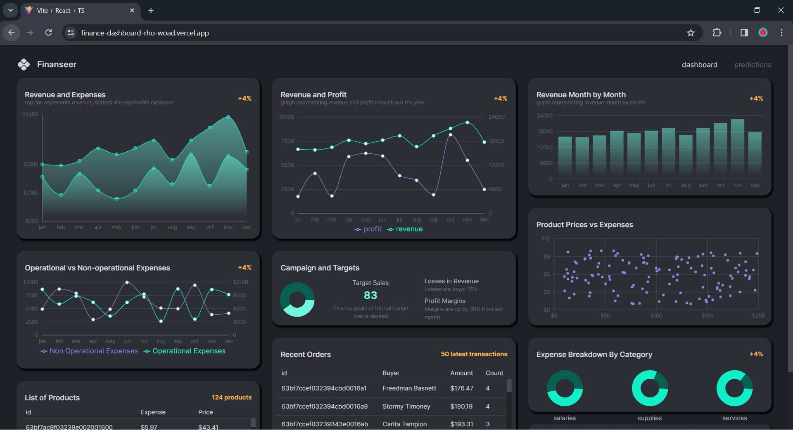
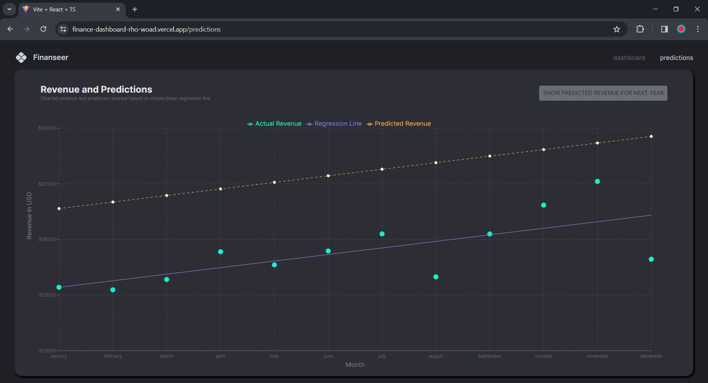

# Finance Dashboard

Live url --> https://finance-dashboard-rho-woad.vercel.app/ 

- This is a finance dashboard which shows multiple interactive graphs (pie chart, bar chart, line chart, scatter plot). 
- These graphs show a multitude of information related to revenue, expenses, profit, product list and order history (based on dummy data) 
- There is a predictions tab on the top left side of the app which takes you to revenue vs month graph.  
- This predictions tab also displays a liner regression line. 
- Clicking on the 'SHOW PREDICTED REVENUE FOR NEXT YEAR' displays the predicted regression line of the revenue for next year. 

## Tech Stack

- implemented Typescript for this project 
- Express.js is used for building the backend API of this project with Node.js 
- for database configuration, this project uses MongoDB 
- used react-router-dom to manage routing of requests 
- simplified state management using reduxjs/toolkit 
- applied Material Design styles using using Material UI 
- recharts package is used to create graphs shown on the dashboard 
- used regression-js module to get simple linear regression line for prediction of revenue 
